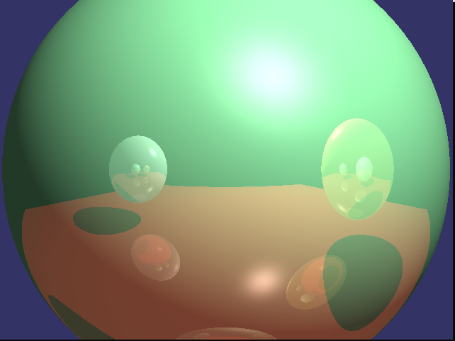
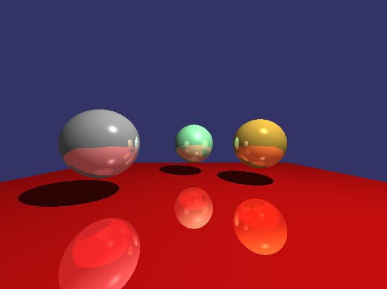
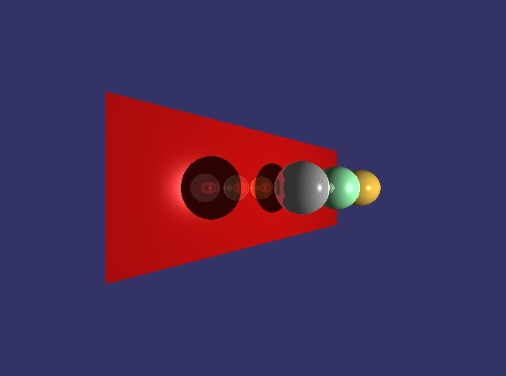

# Simple Ray Tracer

This repository contains a simple ray tracer implemented in C++ using OpenGL and GLUT (freeglut) libraries. The ray tracer can render 3D scenes containing spheres and triangles with support for basic lighting and reflection.

## Images

  

  

  

## Setup

1. Clone the repository and navigate to the project directory.
2. Make sure you have the required dependencies installed and linked properly.
3. Compile the code using a C++ compiler that supports C++11 or higher.
4. Run the executable.

## Notes

Feel free to use, modify, and extend this simple ray tracer for your own projects. Happy ray tracing!
